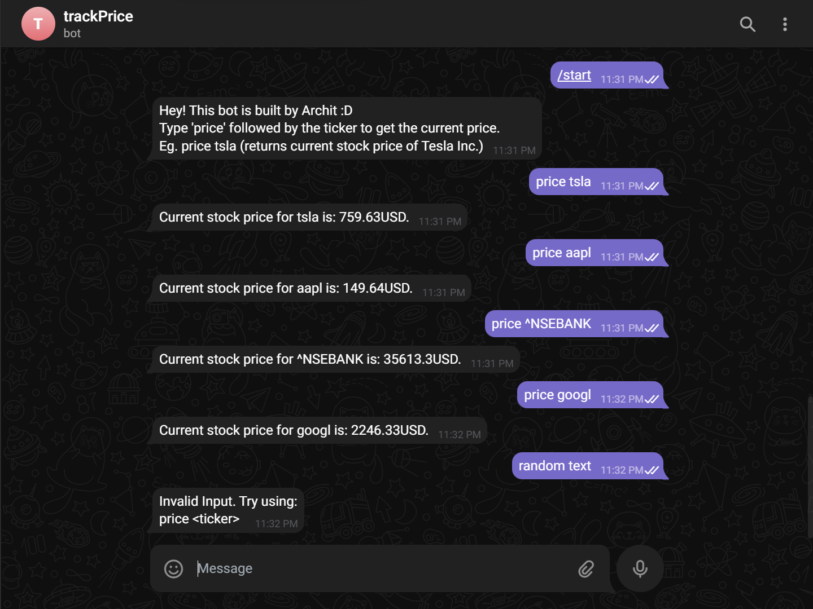

# Telegram Bot Python

A telegram bot coded in Python which fetches the current stock price of the ticker requested.

## Setup

The following commands can be run to install the necessary packages to run the Python script.

```bash
pip install pyTelegramBotAPI
```
Telegram Bot API

```bash
pip install python-decouple
```
Used to configure API_KEY from .env file for the Bot API to use as credentials.

```bash
pip install yfinance
```
Used to access market data.

## Usage

The file "main.py" has the Python code and can be executed using below command.

```bash
python main.py
```

## Demonstration

### Telegram chat with Bot


### Output in terminal while running
